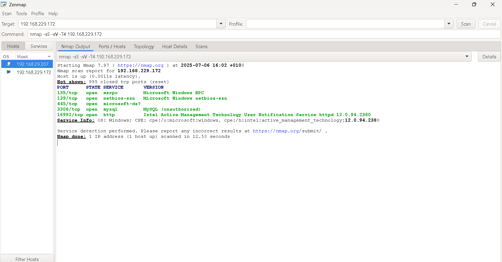

# cybercloud-labs
Projects on cybersecurity and AWS cloud security. Focused on building skills toward ethical hacking and cloud engineering roles.
#  Module 1: Network Recon with Nmap

## Project Objective
Perform a network scan to identify open ports and services on a Windows host, using Nmap, and analyze potential vulnerabilities based on service exposure.

## Tools Used
- Nmap 7.97
- Kali Linux (Terminal)
- Target OS: Windows (Local Virtual Machine)

## Scan Command Used
```bash
nmap -sS -sV -T4 192.168.229.172

##  Screenshots



Analysis & Security Implications

Port 135, 139, 445:
These are commonly abused ports for Windows-based exploits like EternalBlue or SMB relay attacks. They should not be publicly exposed.

Port 3306 (MySQL):
MySQL server is open and appears unauthorized. If not secured with strong authentication and firewall rules, it’s vulnerable to data theft or brute-force.

Port 16992 (Intel AMT):
Intel Active Management is an enterprise-level remote admin tool. If exposed externally, it's a severe risk — attackers can gain deep system access.


What I Learned

How to use Nmap for active recon

How to identify potentially dangerous open ports

The importance of closing unnecessary ports on enterprise systems


Skills Demonstrated

Network scanning

Port/service enumeration

Threat awareness

Report writing & documentation


Notes

This project was completed as part of Module 1 of my Cybersecurity training. Real scans were done in a safe lab VM environment.
