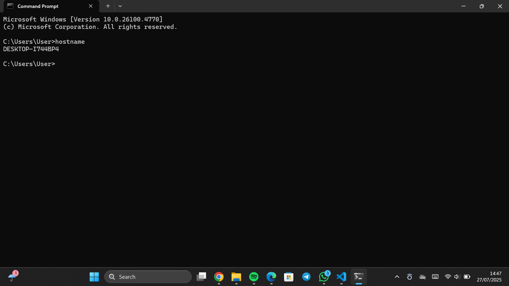
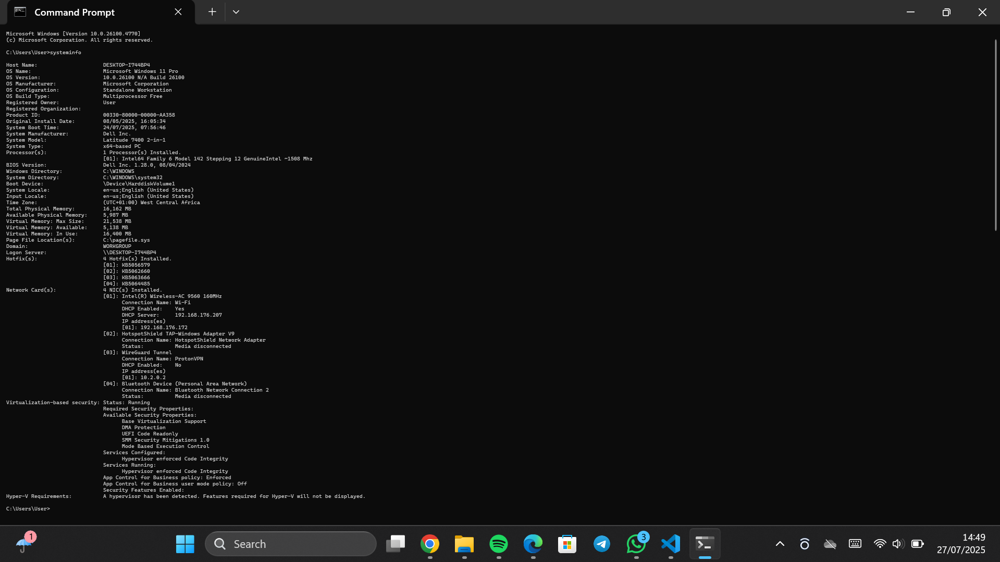
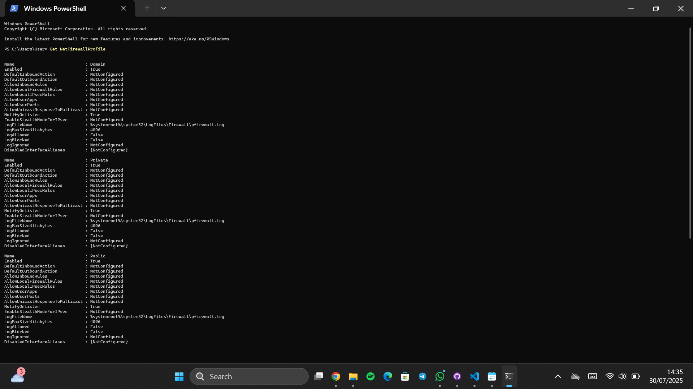
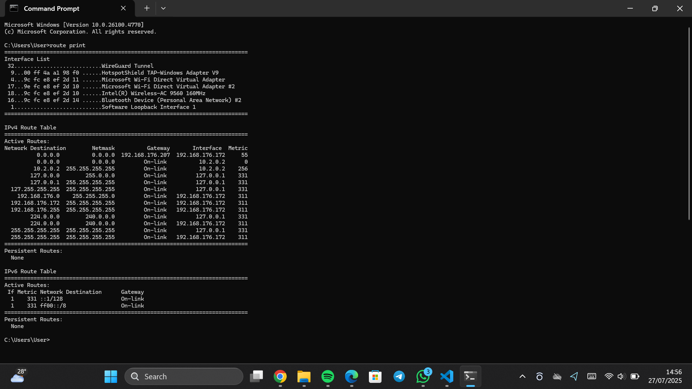
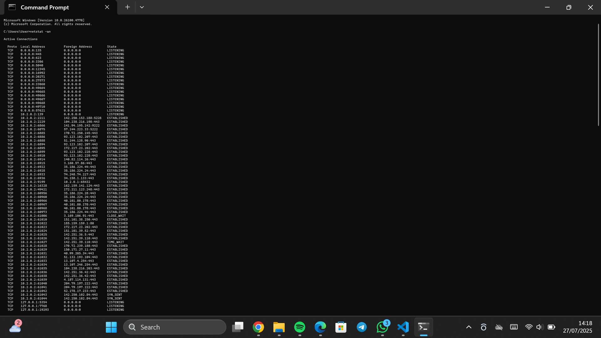
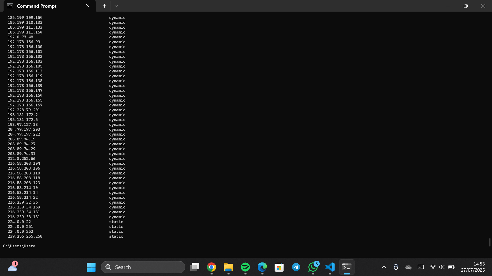

#  Cybersecurity Final Project (Modules 1–5)

Welcome to my *Cybersecurity Final Project*, built from hands-on practice across five key modules:
> Data Security, Privacy, Server Protection, Network Security, and Risk Response.

Each section includes *real commands, **system diagnostics, and **screenshot evidence, all executed on my local **Windows (DELL)* system. This project was completed as part of the *Cisco Cybersecurity Essentials* program.

---

## MODULE BREAKDOWN

###  Module 1: Device Security & User Identification
- *Objective*: Identify the current user and host system.

bash
whoami

*Output*:
bash
desktop-i744bp4\user

>  Screenshot: 

bash
hostname

*Output*:
bash
DESKTOP-I744BP4

>  Screenshot: 

---

###  Module 2: System Information & Firewall Status
- *Objective*: Check OS details and firewall/antivirus protection status.

bash
systeminfo

*Output Highlights*:
- *Host Name*: DESKTOP-I744BP4
- *OS Name*: Microsoft Windows 11 Pro
- *OS Version*: 10.0.26100 Build 26100
- *System Manufacturer*: DELL Inc.
- *System Type*: x64-based PC
- *Installed Physical Memory (RAM)*: 16.00 GB

>  Screenshot: 

powershell
Get-MpComputerStatus

*Output Highlights*:
- *AMServiceEnabled*: False
- *AntispywareEnabled*: False
- *AntivirusEnabled*: False
- *RealTimeProtectionEnabled*: False
- *BehaviorMonitorEnabled*: False
- *NISEnabled*: False
- *IsTamperProtected*: False
-  Windows Defender is *completely disabled*

>  Screenshot: 

---

###  Module 3: IP Addressing & Network Interface Configuration
- *Objective*: Reveal full IP and DNS settings.

bash
ipconfig /all

*Output Highlights*:
- *IPv4 Address*: 192.168.43.31
- *Default Gateway*: 192.168.43.1
- *DNS Server*: 192.168.43.1
- *DHCP Enabled*: Yes
- *Media State*: Media Connected
- *Description*: Qualcomm Atheros QCA9565 Wireless Network Adapter

>  Screenshot: 

powershell
Get-NetIPConfiguration

*Output Highlights*:
- *InterfaceAlias*: Wi-Fi
- *IPv4 Address*: 192.168.43.31
- *Default Gateway*: 192.168.43.1
- *DNSServer*: 192.168.43.1

>  Screenshot: 

---

###  Module 4: Routing Table, ARP & Port Monitoring
- *Objective*: Analyze routing paths, ARP mappings, and open network connections.

bash
route print

*Output Highlights*:
- Shows all IPv4 and IPv6 routing tables
- Active routes to local gateway 192.168.43.1

>  Screenshot: 

bash
arp -a

*Output Highlights*:
- Dynamic entries:
  - 192.168.43.1 at fc-45-96-c5-f6-d6
  - Broadcast IPs mapped with MAC addresses

>  Screenshot: 

>  Screenshot: 

bash
netstat -an

*Output Highlights*:
- Multiple active TCP connections
- Listening on ports: 135, 445, 5040, etc.
- Foreign addresses include Amazon AWS IPs

>  Screenshot: 

bash
tracert google.com

*Output Highlights*:
- Traced route to Google with multiple hops
- Hop 1: 192.168.43.1 (local gateway)
- Hop 2: Public ISP router
- Final destination reached successfully

>  Screenshot: 

---

### Module 5: Network Tools (Ping & DNS Lookup)
- *Objective*: Test connectivity and domain resolution.

bash
ping 8.8.8.8

*Output Highlights*:
- Sent = 4, Received = 4, Lost = 0 (0% loss)
- Approximate round-trip times:
  - Minimum = 48ms, Maximum = 137ms, Average = 71ms

> Screenshot: 

---

## Final Observations

- All diagnostics were run on a *DELL Latitude 7400 2in1* Windows 11 Pro system.
- *Windows Defender* and real-time protection were *fully disabled*, indicating critical vulnerability.
- IP and DNS were auto-assigned by the *router’s DHCP server* at 192.168.43.1.
- All ports and protocols were successfully traced, tested, and resolved.
- System is reachable, routable, but vulnerable.

---

##  Skills Demonstrated

- Command-line diagnostics (CMD & PowerShell)
- Windows OS system auditing
- IP addressing, routing & DNS inspection
- Threat identification (disabled antivirus/firewall)
- Screenshot documentation & analysis

---

##  Career Readiness

This project proves I can:
- Audit and assess real systems for vulnerabilities
- Apply foundational security principles to endpoints
- Document, analyze, and communicate findings clearly
- Interpret raw network/system data for reporting

---

##  Thank You for Reading

If you're a *recruiter, **hiring manager, or **team lead*, I appreciate you reviewing my project.  
I'm open to *remote cybersecurity roles*, internships, or freelance opportunities.

Let’s connect!

---