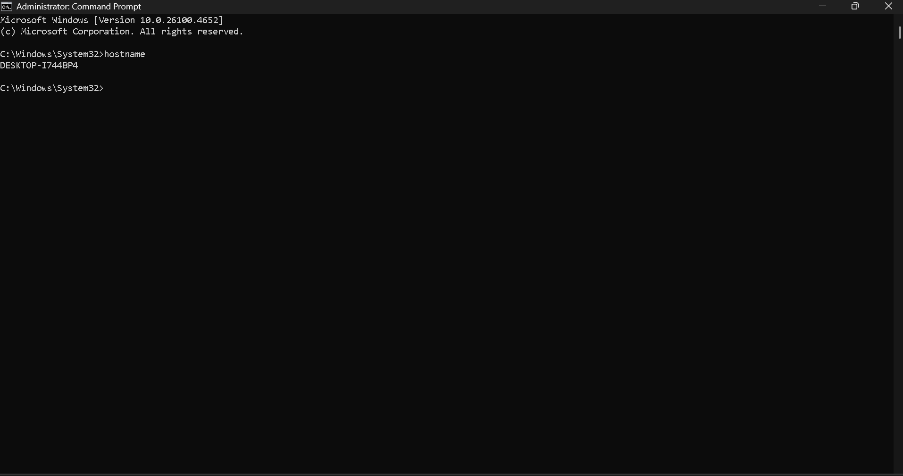
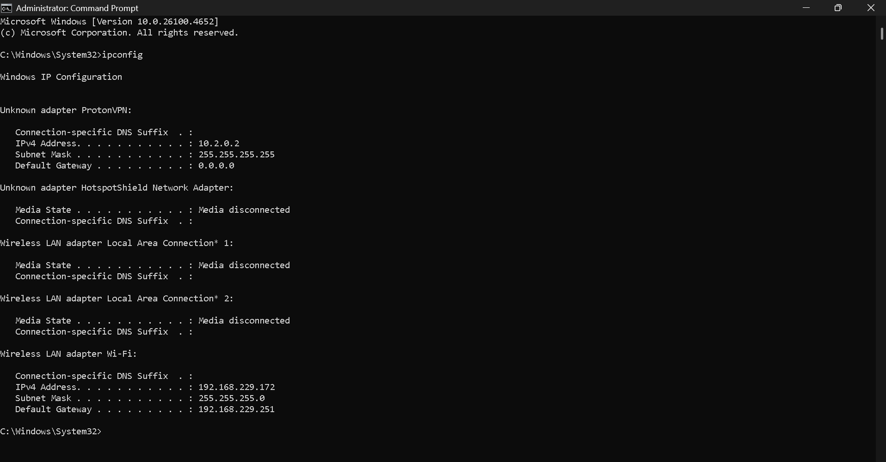
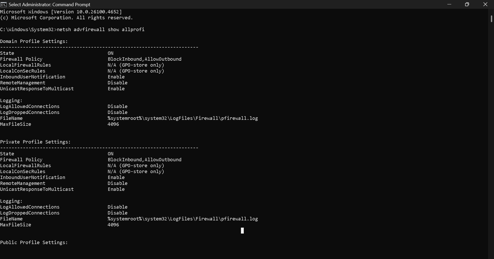
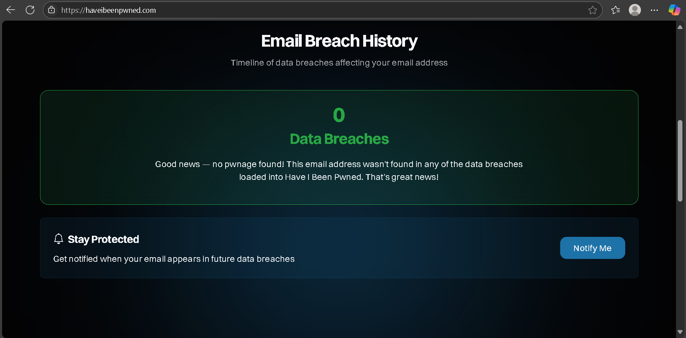

# Module 3 – Data Privacy & Protection Project

## Topics Covered
- Protecting Devices and Network
- Data Maintenance and Ownership
- Online Privacy Protection
- Risky Online Behaviors
- Firewall Configuration and IP Management
- Breach Check Using HaveIBeenPwned

---

##  System Information Commands (Windows)

### 1. whoami

desktop-i744bp4\user

### 2. hostname

DESKTOP-I744BP4

---

### 3. ipconfig

IPv4 Address: 192.168.229.172  
Subnet Mask: 255.255.255.0  
Default Gateway: 192.168.229.251

### 4. netsh advfirewall show allprofiles

Domain Profile Settings:
State: ON  
Firewall Policy: BlockInbound, AllowOutbound

Private Profile Settings:
State: ON  
Firewall Policy: BlockInbound, AllowOutbound

Public Profile Settings:
State: ON  
Firewall Policy: BlockInbound, AllowOutbound

### 5. hibp email check
*Result:* No breaches found for this email.

Used [HaveIBeenPwned.com](https://haveibeenpwned.com) to confirm no data breach exposure.

## What I Learned

- How to use basic Windows system commands to inspect network setup.  
- Verified firewall protection status.  
- Learned how to check email breach status using HIBP.  
- Understood how to document cyber hygiene in a real-world format.

---

##  Tools Used

- Command Prompt  
- HaveIBeenPwned.com  
- Visual Studio Code  
- GitHub

---

##  Skills Demonstrated

- OSINT basics  
- Email breach tracking  
- Windows command-line navigation  
- Network diagnostics  
- Firewall verification  
- Cyber hygiene documentation

---

## Certification

This Project was completed as part of the *Cisco Cybersecurity Professional* course training.