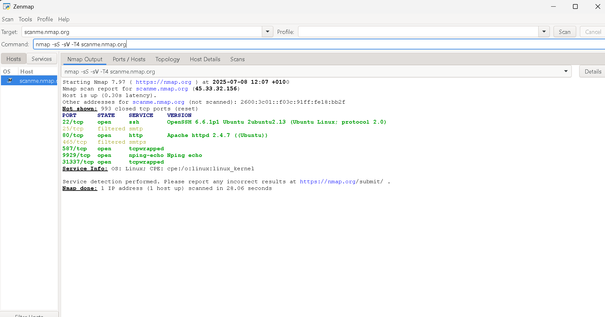

# Module 2 Project – Cybersecurity Attacks & Vulnerability Analysis

This project is a practical demonstration of real-world attack vectors, service vulnerabilities, and port scanning techniques.  
It was built during my cybersecurity training on Cisco Networking Academy as part of my hands-on portfolio.

## Learning Source

- Cisco Networking Academy – Cybersecurity Essentials  
- Upcoming: Coursera Cybersecurity Specialization (Financial Aid in Progress)

## Project Goals

- Run a real nmap scan against a live target
- Identify open ports and services
- Detect outdated/vulnerable services
- Explain possible exploits and defenses

## screenshots

See below for visual evidence of the scan results.

##  Full Port & Vulnerability Analysis

### Port 22 - SSH (OpenSSH 6.6.1)
- *Exploit*: Outdated SSH version vulnerable to brute-force attacks (CVE-2015-5600)
- *Risk*: Unauthorized remote access
- *Fix*: Update to OpenSSH 9+, disable password login, enforce SSH keys only

### Port 25 - SMTP (Filtered)
- *Exploit*: Potential spam relay if opened and misconfigured
- *Risk*: Your server could be used to send phishing/spam emails
- *Fix*: Keep it filtered unless absolutely needed. Use modern SMTP servers with auth.

### Port 80 - HTTP (Apache 2.4.7)
- *Exploit*: Vulnerable to XSS and DoS attacks (e.g., CVE-2017-3169)
- *Risk*: Website defacement, data leak, or remote shell access
- *Fix*: Update Apache to the latest version, disable unused modules

### Port 465 - SMTPS (Filtered)
- *Risk*: If exposed and misconfigured, attackers can abuse for encrypted spam sending
- *Fix*: Keep closed. Only open with strict email policy and encryption.

### Port 587 - TCPWrapped
- *Exploit*: Unknown, but wrapping may hide vulnerable service
- *Fix*: Perform deeper scans internally, restrict external access

### Port 9929 - Nping Echo
- *Exploit*: Can be used for DoS or recon if left exposed
- *Fix*: Disable or close unless needed for Nmap/Nping testing

### Port 31337 - TCPWrapped
- *Exploit*: Historically used for backdoors or rootkits
- *Risk*: Suspicious. May indicate old hacker habit or hidden service
- *Fix*: Investigate internally. Block external access completely.

## What I Learned

- How to run and interpret nmap scans on live servers
- Detection of outdated/vulnerable services (Apache, OpenSSH)
- Logical exploit path for each open port
- Basic defensive strategies against network threats

## Skills Demonstrated

- Network reconnaissance
- Real-world vulnerability analysis
- Threat detection and reporting
- Markdown documentation

