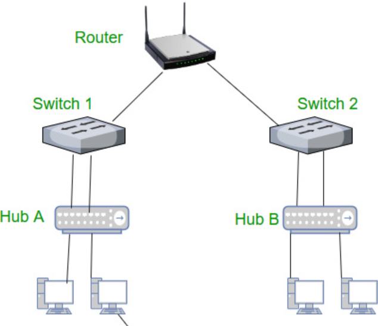
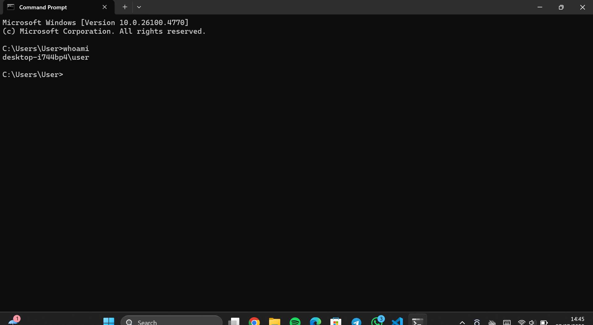
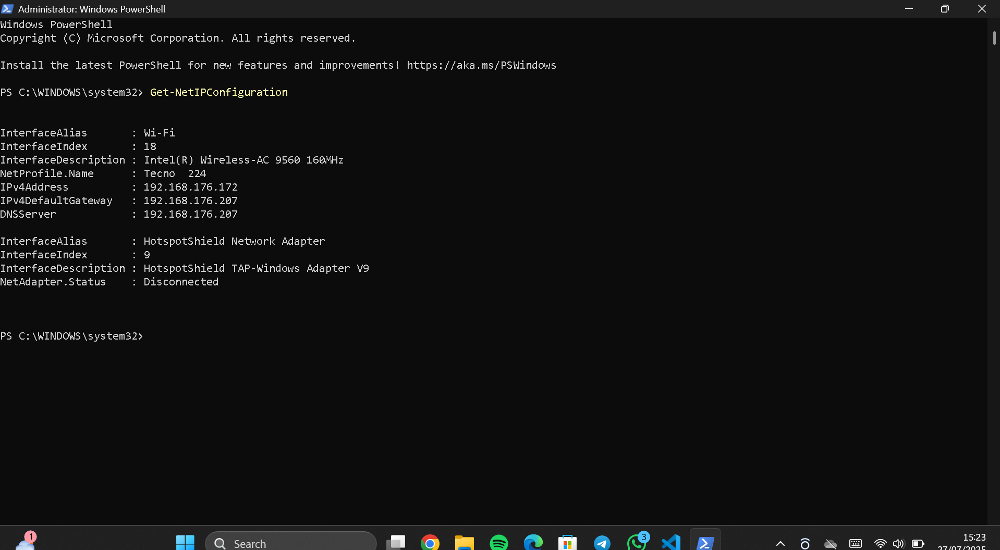
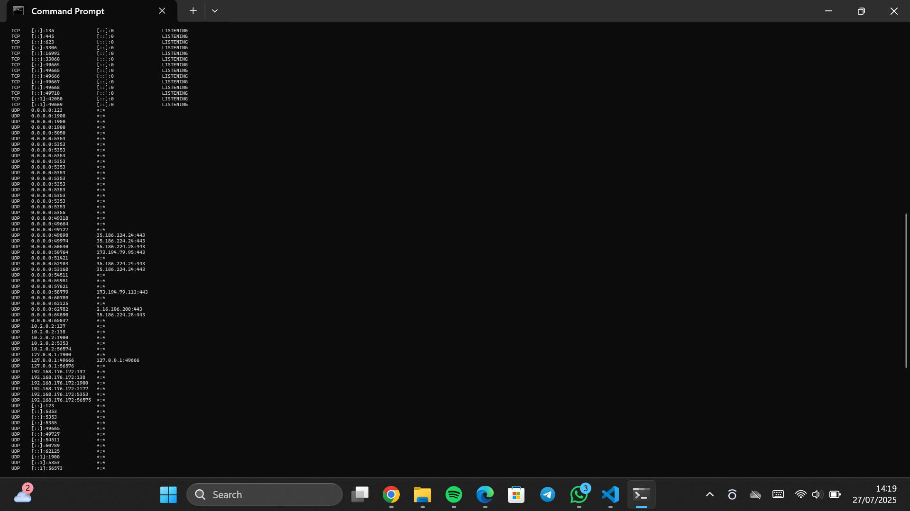
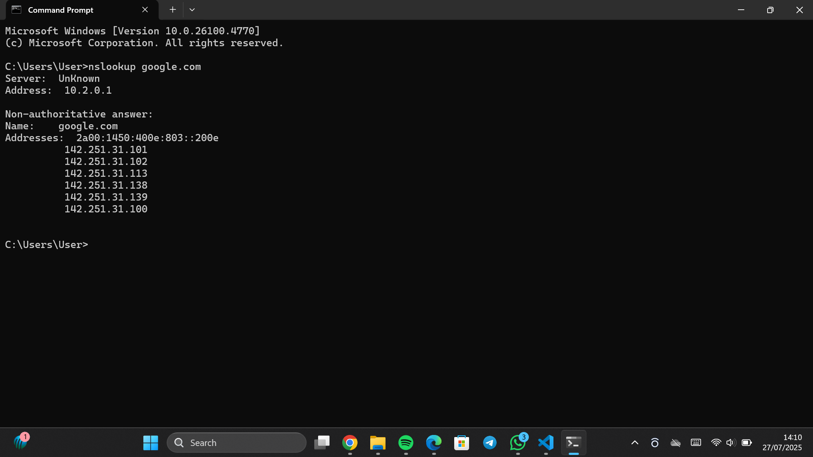
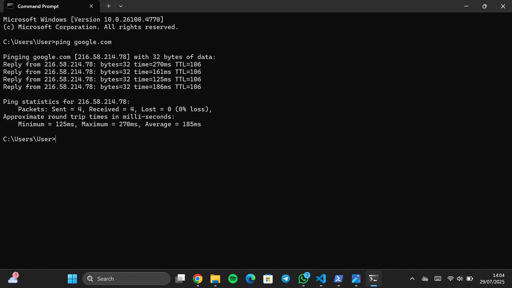
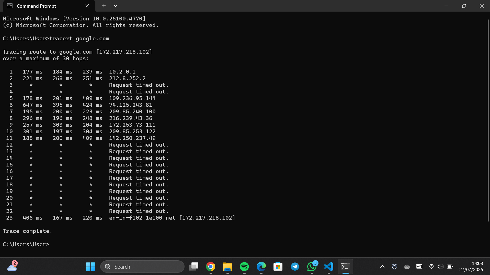

# Networking Basics Project

Welcome to my *Networking Fundamentals Project* – designed to demonstrate hands-on understanding of basic network components, topologies, IP addressing, and diagnostic tools. This project serves as both a learning exercise and a showcase of my foundational networking skills.

This project was built step-by-step by running real network commands on my PC, analyzing the outputs, and documenting the screenshots and explanations in detail. It is structured in a way that any beginner can follow and learn how networking tools work in real-life scenarios.

---

##  Objective

To demonstrate how devices such as *routers, switches, hubs, and PCs* communicate on a basic network. Includes the use of diagrams, IP addressing, and command-line testing tools.

---

##  Course Source

This project was completed as part of the *Cisco Networking Basics Course*. All exercises and screenshots were done on my local machine to reinforce learning through hands-on practice.

---

##  Network Devices Diagram

This diagram illustrates the flow of data through common networking devices:

- *Router* – Connects your network to the internet.
- *Switch* – Sends data directly to the destination device (efficient).
- *Hub* – Broadcasts data to all devices (older, less efficient).
- *PCs* – Devices connected to the network.

---

##  Commands and Utilities Used

✅ whoami  
✅ hostname  
✅ systeminfo  
✅ ipconfig /all  
✅ Get-NetIPConfiguration  
✅ arp -a  
✅ netstat -an  
✅ nslookup  
✅ ping  
✅ tracert

Each command was tested and screenshots were taken as proof of output.

---

## 🔹 1. whoami

###  Purpose:
Displays the current *user account* that is logged in and executing commands.

###  What I Did:
bash
whoami

###  What It Showed:
Returned my user path — confirming which user session was active.

---

## 🔹 2. hostname

###  Purpose:
Displays the *name of the computer* on the local network.

###  What I Did:
bash
hostname

###  What It Showed:
The system's hostname – how other computers recognize this PC on the network.

---

## 🔹 3. systeminfo

###  Purpose:
Displays *detailed system configuration* including OS version, RAM, and hotfixes.

###  What I Did:
bash
systeminfo

###  What It Showed:
- OS version and architecture  
- System manufacturer and model  
- Total memory  
- Network adapter configuration

---

## 🔹 4. ipconfig /all

###  Purpose:
Shows *full IP settings* for each network adapter.

###  What I Did:
bash
ipconfig /all

###  What It Showed:
- IPv4 address  
- MAC address  
- DHCP and DNS info  
- Gateway and Subnet mask

---

## 🔹 5. Get-NetIPConfiguration (PowerShell)

###  Purpose:
Displays IP and gateway info using PowerShell.

###  What I Did:
powershell
Get-NetIPConfiguration

###  What It Showed:
- IP address: 192.168.176.172  
- Gateway: 192.168.176.207  
- DNS Server: 192.168.176.207

---

## 🔹 6. arp -a

### 🔍 Purpose:
Displays the *ARP table* — showing IP-to-MAC address mapping on LAN.

### 🖥 What I Did:
bash
arp -a

###  What It Showed:
- Dynamic/static entries  
- IP ↔ MAC address associations

  

---

## 🔹 7. netstat -an

###  Purpose:
Displays *active connections*, ports, and states.

###  What I Did:
bash
netstat -an

###  What It Showed:
- Listening and established TCP/UDP ports  
- Remote IPs and states like ESTABLISHED, LISTENING

---

## 🔹 8. nslookup google.com

###  Purpose:
Resolves a *domain name to an IP* using DNS.

###  What I Did:
bash
nslookup google.com

###  What It Showed:
- IP address of google.com  
- DNS resolver used

---

## 🔹 9. ping google.com

###  Purpose:
Tests network reachability and *packet loss* between my computer and Google's server.

### What I Did:
bash
ping google.com

###  What It Showed:
- Round trip times  
- Packet loss  
- Confirmation that the network is working

---

## 🔹 10. tracert google.com

### Purpose:
Traces the *route packets take* to reach Google servers.

###  What I Did:
bash
tracert google.com

###  What It Showed:
- Number of hops  
- IP addresses and response time of each router on the path

---

##  What I Learned

- The purpose and behavior of essential networking commands
- How to read and interpret IP addresses, MAC addresses, and DNS information
- How devices like routers, hubs, and switches operate differently
- How to trace the path of a packet and see where connections are being made
- Real-world testing of a PC's network behavior

---

## Tools Used

- Windows Command Prompt  
- PowerShell  
- Cisco Networking Basics (course content)  
- VS Code (for documentation)  
- Git & GitHub (for project publishing)

---
