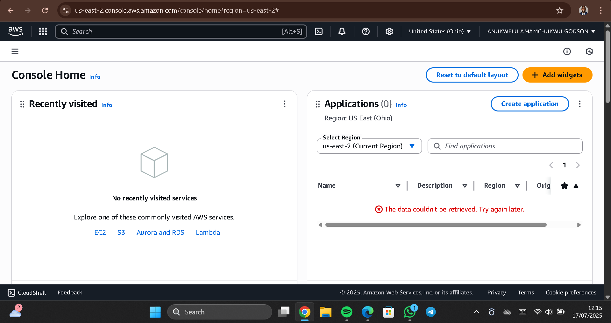
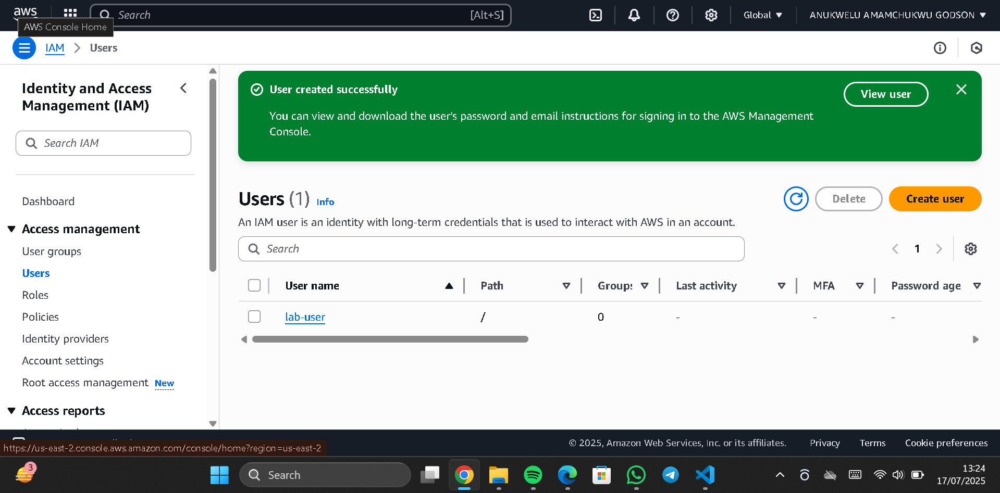
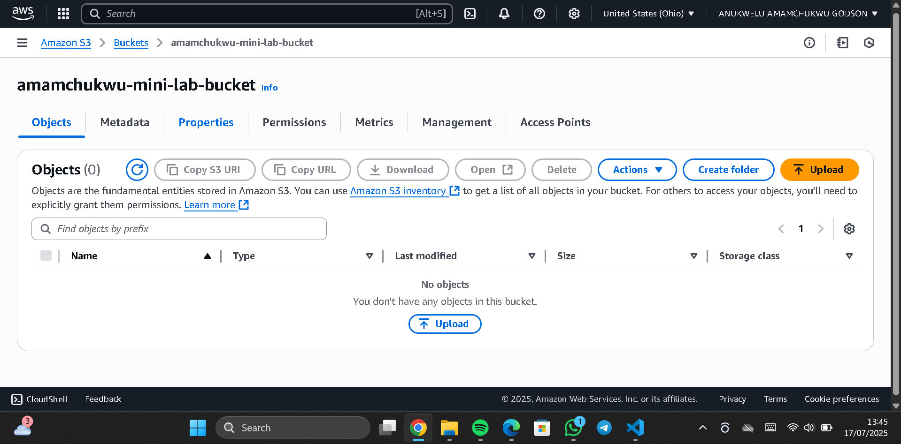
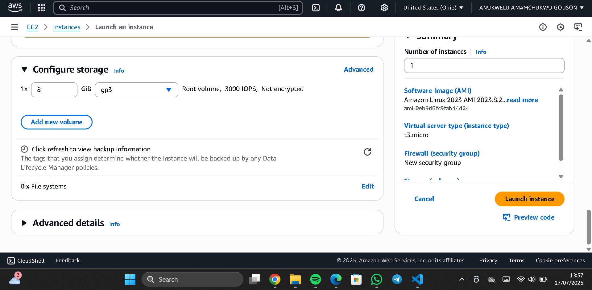
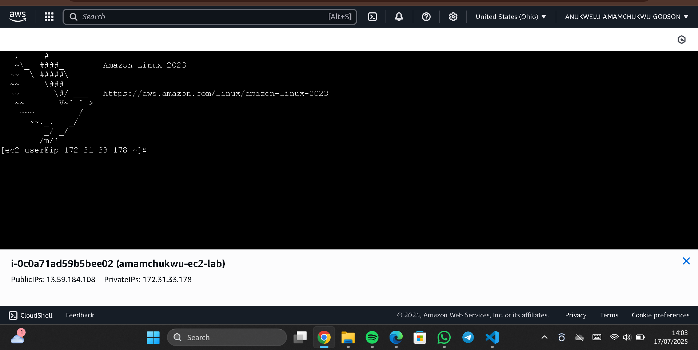
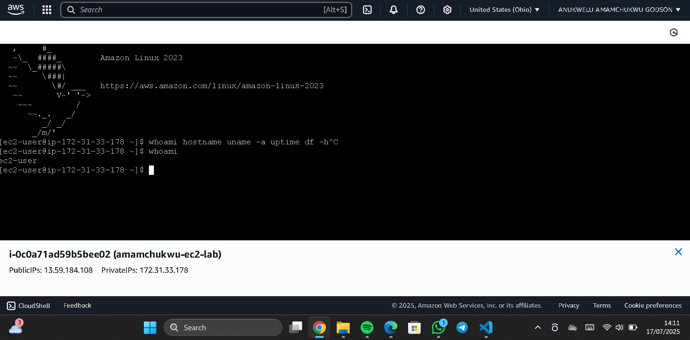

# AWS Cloud Practitioner Lab Project

This project demonstrates foundational hands-on experience using Amazon Web Services (AWS), focusing on three core services: *Amazon S3, **Amazon EC2, and **IAM*. The objective is to simulate real-world cloud operations by creating, configuring, and managing AWS resources via the AWS Console and Linux terminal.

##  Step-by-Step Execution

### 1️⃣ AWS Account Creation and Console Access

Created a free-tier AWS account and successfully logged into the AWS Console.

 Screenshot:  

### 2️⃣ Exploring the AWS Console

Navigated the AWS Console to locate key services such as EC2, S3, IAM, and more.

 Screenshot:  

### 3️⃣ IAM User Creation

Created an IAM user to demonstrate identity and permission management in AWS.  
Steps taken:
- Created a new IAM user (console access only)
- Set custom password
- Skipped group and permissions setup (for basic demo)
- Logged in with new IAM credentials

 Screenshot:  

### 4️⃣ S3 Bucket Creation

Created a secure Amazon S3 bucket using default configurations:
- Blocked public access
- Enabled SSE (Server-Side Encryption)

 Screenshots:  
- Bucket configuration:   
- Successful creation: 

### 5️⃣ Launching EC2 Instance

Launched a *t2.micro* EC2 instance with:
- Amazon Linux 2 AMI
- Default VPC/subnet
- Auto-generated key pair
- Security group with SSH (port 22) access

 Screenshots:  
- Launch settings:   
- Instance running: 

### 6️⃣ Connecting to EC2 (Browser Terminal)

Used the EC2 Connect feature to access the instance via browser-based Linux terminal.

 Screenshot:  

### 7️⃣ Running Linux Diagnostic Commands

Executed basic Linux terminal commands to explore system-level information:

| Command   | Description                     |
|-----------|---------------------------------|
| whoami  | Current user                    |
| hostname| Machine hostname                |
| uname   | System kernel and OS info       |
| uptime  | System uptime and load          |
| df      | Disk usage stats                |

 Screenshots:
- 
- 
- 
- 
- 

### 8️⃣ EC2 Instance Termination

Terminated the EC2 instance after usage to prevent AWS charges.

 Screenshot:  

##  What I Learned

- ✅ Creating and managing S3, EC2, and IAM resources
- ✅ Navigating the AWS Console effectively
- ✅ Executing Linux commands inside an AWS EC2 instance
- ✅ Following cost-saving best practices (resource cleanup)
- ✅ Gaining confidence in foundational cloud infrastructure concepts

##  Author

*Anukwelu Amamachukwu Godson*

##  Acknowledgment

This project was executed through the *AWS Skill Builder* platform as part of my foundational cloud training.  
Thanks to AWS for providing practical, hands-on learning resources for beginners.

## ⚠ Note

> Always terminate EC2 instances and delete unused resources after use to avoid unexpected billing.